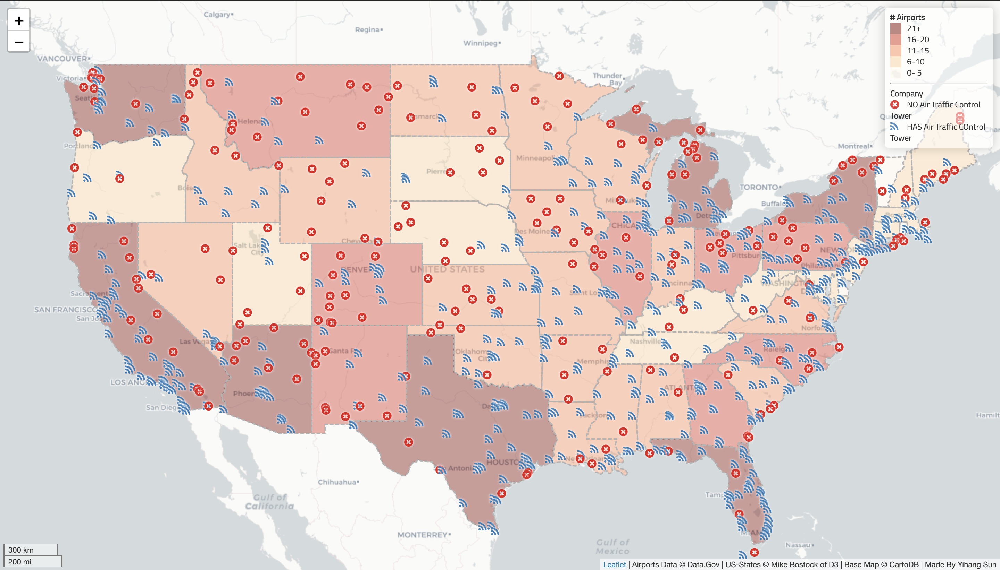
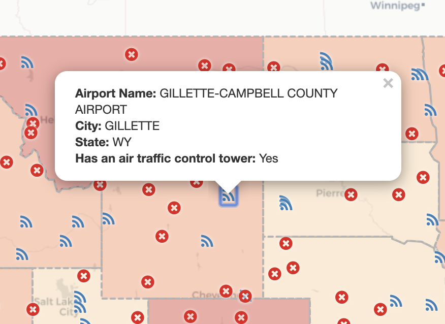
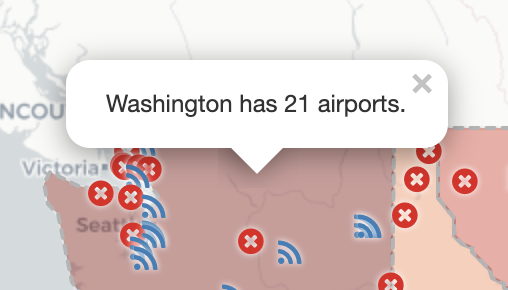

# U.S. Airports Web Map
**I. Introduction**
This is an interactive web map of all the airports in the United States. All airports are marked with icon on the map based on their coordinates. The icons <i class="fa fa-rss marker"></i> represent the airport has an air traffic control tower, and the other means no control tower. The basemap is presenting numbers of airports in each states with sequtial color ramp. The darker color means more amounts of airports. The map is zoomed with the center `[38.987682, -97.125537]` so that people can have a broad view of the U.S.. There are more features which will be explained in the following content.

_Here is the overall looking:_


**II. Interactive Functions**
- **_Airports Information_**
A popup window is available in the map to show the general information about the airport that was clicked.


- **_State-Level Airports Stats._**
A popup window is avaiable in the map when users click on the state to see the statistics of airports within the selected state.


**III. Libraries**
- https://unpkg.com/leaflet@1.3.1/dist/leaflet.css
- https://cdnjs.cloudflare.com/ajax/libs/font-awesome/4.7.0/css/font-awesome.css
- https://fonts.googleapis.com/css?family=Titillium+Web
- https://unpkg.com/leaflet@1.4.0/dist/leaflet.js
- https://cdnjs.cloudflare.com/ajax/libs/leaflet-ajax/2.1.0/leaflet.ajax.min.js
- https://ajax.googleapis.com/ajax/libs/jquery/3.1.0/jquery.min.js
- https://cdnjs.cloudflare.com/ajax/libs/chroma-js/1.3.4/chroma.min.js

**IV. Data Sources**
- `airports.geojson` contains all the airports in the United States. This data is converted from a shapefile, which was downloaded and unzipped from
[Data.gov](https://catalog.data.gov/dataset/usgs-small-scale-dataset-airports-of-the-united-states-201207-shapefile).
- `us-states.geojson` is a geojson data file containing all the states' boundaries of the United States. This data is acquired from [Mike Bostock](https://bost.ocks.org/mike/) of [D3](https://d3js.org/).

**V. Credit**
```attribution: 'Airports Data &copy; Data.Gov | US-States &copy; Mike Bostock of D3 | Base Map &copy; CartoDB | Made By Yihang Sun'```

**VI. Acknowledgment**
- Leaflet
- ajax.googlepis.com
- font-awesome
- Professor Bo Zhao
